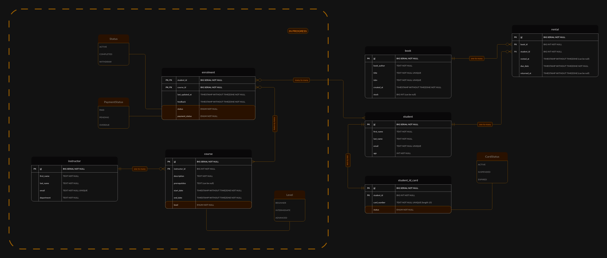

# Student Enrollment App

## Description

The "Student Enrollment App" is a Java Spring application designed to help manage student enrollments, book inventory, and rentals. It uses a PostgreSQL database and is set up to be easily deployed and scaled using Docker. The application provides a RESTful API, allowing users to add, update, retrieve, and delete information about books, rentals, and students.

---

## UML Diagram



## Features

- Manage book inventory
- Handle book rentals and returns
- Enroll students (in progress) and manage student information
- PostgreSQL database integration
- Easily deployable docker configuration

## In-Progress Features

- **Payment Module Integration**: Currently under development as indicated in the UML diagram, the payment module will handle different payment statuses such as paid, pending, and overdue. This will be crucial for managing financial transactions related to book rentals, ensuring a seamless and automated process for fee collection and status updates.

- **Course Enrollment**: Another feature in progress involves the course enrollment capabilities, which will allow students to enroll in courses directly through the app. This feature will include handling of various course levels such as beginner, intermediate, and advanced, providing a dynamic and flexible learning management system.

Based on the technologies and configurations you have provided in your Maven `pom.xml` and your Docker setup, here's how you could outline the used technologies in your `README.md` file:

---

## Technologies Used

### Application and Data
- **Java 17**: The application is written in Java, leveraging the modern features of Java 17.
- **Spring Boot 3.2.4**: Utilizes Spring Boot for rapid application development, focusing on convention over configuration.
- **Spring Data JPA**: Simplifies data access operations by using Java Persistence API.
- **Spring Web**: Manages RESTful services via Spring MVC.

### Database
- **PostgreSQL**: Primary database used for production environments, integrated through Spring Data JPA.
- **H2 Database**: Embedded database used for testing, configured to be transient.

### Code Mapping and Reduction
- **MapStruct 1.5.5.Final**: For mapping between DTOs and entity objects, reducing boilerplate code in Java bean mappings.
- **Lombok**: Utilized to minimize boilerplate code like getters, setters, and constructors.

### Build and Deployment
- **Maven**: Manages dependencies and builds the application. Configured to handle resource filtering and project packaging.
- **Docker**: Containers are used to encapsulate the application environment, ensuring consistency across different deployment targets.
- **Docker Compose**: Manages multi-container Docker applications, orchestrating the application and the PostgreSQL database service.

### Testing
- **Spring Boot Starter Test**: Provides essential libraries for testing Spring Boot applications including JUnit, Hamcrest, and Mockito.

### Development Environment
- **IntelliJ IDEA**: The IDE used for developing the application, as seen from the provided screenshot, enhancing developer productivity with robust support for Java and Spring.

### Source Control
- **Git**: Used for version control, facilitating source code management and collaborative development.

### Plugins and Tools
- **Spring Boot Maven Plugin**: Enhances the build process with capabilities such as building executable JARs.
- **Maven Resources Plugin 3.1.0**: Handles the copying of resources during the build phase, ensuring that all non-code resources like properties files are correctly included in the final build artifact.

---

## Getting Started

### Prerequisites

- Java 17
- Maven
- Docker

### Installation

1. Clone the repository:
   ```
   git clone https://github.com/bartlomiejMilosz/student-enrolment-app.git
   ```
2. Navigate to the project directory:
   ```
   cd student-enrolment-app
   ```

### Running the Application

Start the application using Docker Compose:
   ```
   docker-compose up --build
   ```
   This command will set up the PostgreSQL database and run the application.

### Accessing the Application

Once the application is running, you can access it at:
```
http://localhost:8080/[specific endpoint]
```

---

## API Endpoints

The application provides several **RESTful** endpoints:

### Books

- **POST /books**
    - Description: Creates a new book record
    - Request Body: `BookDto`
    - Response: `201 Created`

- **GET /books**
    - Description: Retrieves a list of all books, with pagination
    - Query Params: `page`, `size`
    - Response: `200 OK`

- **GET /books/{id}**
    - Description: Retrieves a specific book by its ID
    - Response: `200 OK`

- **PUT /books/{id}**
    - Description: Updates a book record by ID
    - Request Body: `BookDto`
    - Response: `200 OK`

- **DELETE /books/{id}**
    - Description: Deletes a specific book by its ID
    - Response: `204 No Content`

### Rentals

- **POST /rentals**
    - Description: Creates a rental record for a book
    - Request Body: `RentalDto`
    - Response: `201 Created`

- **PUT /rentals/{id}**
    - Description: Marks a book as returned
    - Response: `200 OK`

### Students

- **POST /students**
    - Description: Enrolls a new student
    - Request Body: `StudentDto`
    - Response: `201 Created`

- **GET /students**
    - Description: Retrieves a list of all students, with pagination
    - Query Params: `page`, `size`
    - Response: `200 OK`

- **GET /students/{id}**
    - Description: Retrieves a specific student by ID
    - Response: `200 OK`

- **PATCH /students/{id}**
    - Description: Partially updates a student record
    - Request Body: `StudentDto`
    - Response: `200 OK`

- **DELETE /students/{id}**
    - Description: Deletes a specific student by ID
    - Response: `204 No Content`

### Error Handling

- **GET /error**
    - Description: Redirects to custom error page
    - Response: Forward to `/error.html`

---

## Contributing

Contributions to the Student Enrollment App are welcome. Please ensure that your commits adhere to the following guidelines:

- Keep descriptions clear and concise
- Include comments in your code where necessary
- Write tests for new features and ensure existing tests pass

## License

This project is licensed under the MIT License - see the LICENSE.md file for details.
